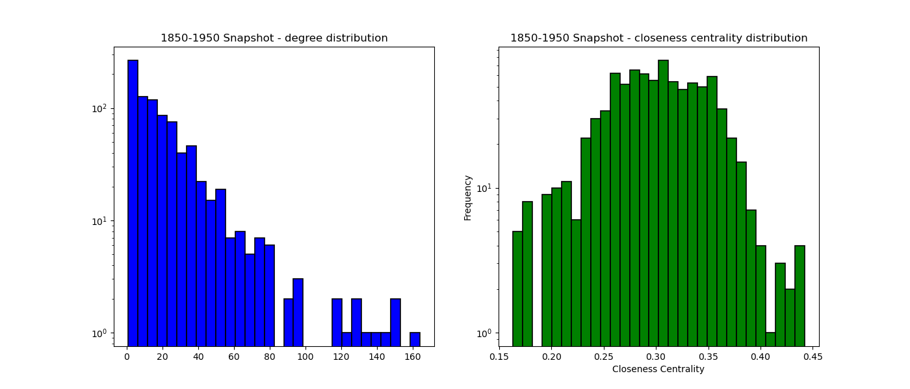

# painter-network-exploration
 Construction of a large painter network with ~3000 painters using the [PainterPalette](https://github.com/me9hanics/PainterPalette) dataset, connecting painters if they lived at the same place for long enough time, approximately.<br>
 The project combines many classical steps of network science:

 - Construction of the network, cleaning
 - Network backbone extraction: disparity filter and thresholding (comparative analysis)
 - Macroscopic network analysis: 
    - degree distribution(s), clustering coefficients
    - centrality measures, and why they do not work on this longitudinal network
    - assortativity, rich-club coefficients
    - painter attribute statistics (e.g. percentage of movements and nationalities), attribute-attribute relationships
- Community detection: (nested) stochastic block model (SBM)
- Mesoscopic analysis: community-attribute statistics
- Visualizations

To my understanding, this is the *largest "painter network from historical geographical data"* constructed and analyzed. Connection of artists / painters is typically done via coexhibitions, such as in the [paper](https://www.science.org/doi/10.1126/science.aau7224) of Barabási and Fraiberger et al. (2018), or in my joint work [here](https://github.com/me9hanics/e-flux_scraping_coexhibition_networks) using e-flux coexhibition data. This project rather tries to reconstruct the historical connections based on temporal and locations information of painters, which is extracted into my dataset (PainterPalette) from Wikidata.

The PainterPalette dataset provides information on ~10000 painters from antiquity to today's age, with various biographical, geographical and stylistic data. From this, a network of painters is constructed, cleaned, and analyzed. Statistical measures of painter attributes are also computed. Then, communities in the network are detected using a (nested) stochastic block model (SBM), and attributes across the communities are compared (such as differences in female representation).

<div align="center" style="text-align: center;">
  
</div>

The results show, that due to the historical / longitudinal nature of the network, certain measures give different results as in comparison to typical social networks - such as power-law distribution $\alpha$ values, which are typically between 2 and 3 but much higher for our network. The network resembles a long chain of social network snapshots in time, limiting the power-law effect, however snapshots of the network omit to these phenomenons as expected.<br>The network is assortative, and the rich-club effect is more prominent the more higher the degree. Statistics of attributes show insights such as the increase of female representation over time, and Russian artists have the most paintings on WikiArt in the dataset.<br>
From the communities of the painters, we can see great differences in attributes across the communities such as female representation, observing that there is one standout community with very high average of WikiArt paintings (consisting of French and American late impressionists and realists).

<br>Scholars can take inspiration from this project:

 - use the resulting network, or the dataset and methods to analyze a network of painters
 - grasp methodology to construct a similar network, and especially to filter the network 
 - generally understand various network science methods and motivations
 - see how a nested SBM can be used to detect communities in a network, and their higher-level hierarchy
 - improve Python data visualization skills
 - possibly: realize the limitations of network science methods (e.g. centrality measures) on historical, "longitudinal" networks

Similar, less extensive works can be found in the repo and subrepos of [ArtProject](https://github.com/me9hanics/ArtProject?tab=readme-ov-file#artproject).

## How to reproduce the results?

The data collection, network construction and analysis are all done in one notebook: `painter_network.ipynb`, just need to run that.<br>
To use the correct environment, you can create a new conda environment with the `environment.yml` file:

```bash
conda env create -f environment.yml
```

or use the `requirements.txt` file with pip:

```bash
pip install -r requirements.txt
```

There is one caveat: the community detection is done with the `graph-tool` library (as it has SBM implemented), which is not available on Windows due to using PyStan in the methods running Monte-Carlo Markov-chain algorithms. Thus, I did not include in the requirements.<br>
The community detection is done separately in the `sbm.ipynb` notebook and results (communities) are loaded into the main notebook. If you would like to run it on Windows, I recommend running a Docker containter - here is my implementation of running `graph-tool` in a VSCode Docker container with extensions: [GitHub repository to run graph-tool in Docker with VSCode](https://github.com/me9hanics/Docker-with-Copilot-JupyterNotebook-VSCode-Graph-tool).

## Network construction

Painter data is taken from [PainterPalette](https://github.com/me9hanics/PainterPalette), and is available in the `data` folder as `artists.csv`. The instances make up our nodes:

| artist | Nationality | citizenship | gender | styles | movement (Wiki) | Movements (Art500k) | birth place | death place | birth year | death_year | FirstYear | LastYear | wikiart_pictures_count | locations | locations_with_years | styles_extended | StylesCount | StylesYears | occupations | PaintingsExhibitedAt | PaintingsExhibitedAtCount | PaintingSchool | Influencedby | Influencedon | Pupils | Teachers | FriendsandCoworkers | Contemporary | ArtMovement | Type |
|---|---|---|---|---|---|---|---|---|---|---|---|---|---|---|---|---|---|---|---|---|---|---|---|---|---|---|---|---|---|---|
| Bracha L. Ettinger | French,Jewish,Israeli | Israel | female | New European Painting | New European Painting | {New European Painting:21} | Tel Aviv | NaN | 1948 | NaN | 1991 | 2009 | 21 | [] | [] | {New European Painting:21} | {New European Painting:21} | New European Painting:1991-2009 | philosopher, psychoanalyst, painter, photographer | NaN | NaN | NaN | NaN | NaN | NaN | NaN | Yes | NaN | NaN |
| Friedrich Schroder-Sonnenstern | German | Germany | male | Art Brut | Outsider art (Art brut) | {Outsider art (Art brut):10} | Sovetsk | Berlin | 1892 | 1982 | 1948 | 1965 | 10 | ['Berlin'] | ['Berlin:1949-1982'] | {Art Brut:10} | {Art Brut:10} | Art Brut:1948-1965 | painter, drawer | NaN | NaN | NaN | NaN | NaN | NaN | NaN | No | NaN | NaN |
| Nuno Gonçalves | Portuguese | Kingdom of Portugal | male | Early Renaissance | Early Renaissance | {Early Renaissance:10} | NaN | NaN | 1425 | 1492 | 1450 | 1490 | 10 | [] | [] | {Early Renaissance:10} | {Early Renaissance:10} | Early Renaissance:1450-1490 | portraitist, painter, musician, researcher | Lisbon, Portugal | {Lisbon:1},{Portugal:1} | NaN | National Museum of Ancient Art (MNAA), Lisbon,... | NaN | NaN | NaN | NaN | No | NaN | NaN |
| Jose Ferraz de Almeida Junior | Brazilian | Brazil | male | Academicism, Realism | Realism | {Realism:64} | Itu | Piracicaba | 1850 | 1899 | 1850 | 1899 | 65 | [] | [] | {Academicism:13},{Realism:52} | {Realism:51}, {Academicism:15} | Realism:1850-1899,Academicism:1850-1895 | painter | Brazil, Rio de Janeiro, Sao Paulo | {Sao Paulo:30},{Brazil:36},{Rio de Janeiro:4} | NaN | NaN | NaN | NaN | NaN | NaN | No | NaN | NaN |
| ... | ... | ... | ... | ... | ... | ... | ... | ... | ... | ... | ... | ... | ... | ... | ... | ... | ... | ... | ... | ... | ... | ... | ... | ... | ... | ... | ... | ... | ... |

There is connection (edge) data, this has to be manually implemented: the "location" attribute is used to connect the painters. The logic is that if two painters lived in the same location at the same time, they are connected.<br>
We gather temporal data from the birth and death years of the painter; however, since it is generally not available when a painter moved to a location, we assume for simplicity that the painter lived in for each location for the same amount of time, averaging over the lifespan. This inspired the following measure for how connected are two painters based on time and location:


$$ TLSI = \frac{{\text{{common years (in their lifetime)}}}}{{\text{{amount of places}}}} \times \text{{amount of common places}} $$


(The dimension of this index is supposed to be time. The longer people live (at the same place), the more likely they are to meet, which makes sense. On the other hand, living at more places does not necessary mean two painters are more likely to meet - if they live 5 and 5 years at two different places, the probability that they meet shall be equal/similar to the probability in the case they lived 10 years at the one place. Locations are included in the formula in a normalized way to still boost the value if two painters lived at the same places.)

The initial network is constructed in NetworkX - it is a generally slow library and nested iterations can take long, therefore I improved performance by using `numpy` computations prior iterations wherever possible.<br>
Nodes with sufficient location and temporal data are added while constructing the network, then edges are added based on the above formula (computing only for pairs of nodes that potentially have an edge based on their lifetime) - if the index is above 0, an edge is added, with the index as weight. We will later filter the network based the edge weight.

The filtered network is stored in the `data\painters.graphml` file (see the filtering for backbone extraction below).<br>
Incorrections are cleaned for consistency.

## Network backbone extraction

To get rid of unrealistic edges, we need to filter the network. I test and compare the results of two methods: thresholding weights, and disparity filter.<br>
For analysis afterwards, I select the filtered network gathered from the disparity filter method with $\alpha = 0.1$. This is stored in the `data\painters.graphml` file.

### Thresholding

From the below plots, we can see that the best values for thresholding are in the interval [5,20]:


The fractions of nodes and edges kept for different thresholds:


### Disparity filter

Every node has a local (asymmetric) measure for the weights of its edges. This helps to keep more edges with low weight, but with higher local importance - the expected range of weights could differ greatly throughout the network, e.g. artists living in Paris will always have many and strong connections, but other artists may not have so many high weight connections.

The following measure is used, composed of the node's strength (sum of weights) and degree, and the weight of the edge. For each edge, we define two disparity values - one for each start node i.e. direction (we have an undirected network, however this measure still can be asymmetric). The probability of an edge from $i$ is calculated as:

$$ p_{ij} = (1 - \frac{w_{ij}}{s_{i}})^{k_i-1} $$

where $w_{ij}$ is the weight of the edge between $i$ and $j$, $s_{i}$ is the total strength of node $i$, and $k_i$ is the degree of node $i$.

(An explanation on using out-degree and out-strength for the general formula e.g. could be that hubs typically have many incoming edges but few outgoing edges, and the impact of the incoming edges can be unimportant - such as with the hyperlinks and the WWW.)

We set the disparity threshold to 0.7 and 0.1 to get roughly the same amount of edges as with the thresholding method.


The decrease in edges and nodes is much straighter (i.e. evenly balanced).

### Clustering coefficients for both methods, comparison


There is a phenomenon that many nodes have either 0 or 1 as clustering coefficient - for the disparity filter method, there is a higher concentration of nodes with clustering coefficient 0, especially with $\alpha = 0.1$. This makes sense, as due to local importance more "globally weak" ties are kept, which likely means the neighbors of neighbors have lower chance of being connected - causing an increase in cases of 0 clustering coefficients.

The decrease in number of nodes with clustering coefficient 1 is much more significant - this might be due to groups of artists that are only connected to each other due to having lived at only one place; some of these artists are connected by the one and only location and hence have a clustering coefficient of 1 - the thresholding method keeps these connections as these are strong connections, but the disparity method has less of a tendency to do so, as connections are locally evaluated.

The development of the network's clustering coefficient (CC) distribution via filtering is interesting. The first method with threshold 5 gives a similar CC distribution as the disparity method with $\alpha = 0.7$, the mean is also similar - as these keep roughly the same amount of nodes and edges, we can say, that up to removing the first ~80-100k connections, neither method has a significant impact on the network's CC distribution. (It might be a bit short-sighted to believe so, but this may suggest that the first 100k connections are the redundant connections, that any "good" method would remove - everything afterwards will bring forward some sort of biases that not all good methods would also bring forward).<br>
When increasing the the threshold and decreasing the $\alpha$ value, the CC distribution changes significantly - aside from what we just mentioned, the disparity filtering method in general keeps more low weight connections, skewing the distribution towards 0, resulting in a much smaller average CC.


## Macroscale analysis results

For the analysis, I used the network generated by the disparity filter with $\alpha = 0.1$.

### Assortativity, rich club behaviour


The network is highly assortative, and omits to rich-club behaviour at high degrees.

### Degree distribution, probability density function


Alpha values for power-law fits are rather high: these two plots are for the thresholds at 5 and 20, having alpha values 12 and 5, respectively, much higher than the typical [2,3] range.

### Snapshot distributions



The power-law fit is much more realistic here: $\alpha=3.6$.

### Female painters by nationality

| Nationality | Female representation (%) |
|-------------|-------------------------------|
| American    | 15.92%                        |
| British     | 14.13%                        |
| Italian     | 9.27%                         |
| German      | 8.62%                         |
| Polish      | 6.67%                         |
| French      | 6.00%                         |
| Dutch       | 5.76%                         |
| Flemish     | 5.00%                         |
| Russian     | 2.85%                         |
| Hungarian   | 0.0%                          |

### Average no. WikiArt paintings by nationality

| Nationality                  | Average no. WikiArt paintings|
|------------------------------|-----------------------------|
| Russian                      | 198.66                      |
| Spanish                      | 190.48                      |
| Italian School of Paintings  | 185.00                      |
| Colombian                    | 177.00                      |
| French                       | 148.51                      |
| Austrian                     | 130.25                      |
| Hungarian                    | 72.57                       |
| German                       | 69.22                       |
| British                      | 67.04                       |

## Community detection - mesoscale analysis

The used method is the nested stochastic block model (nested SBM), which is a hierarchical version of SBMs, finding connections on higher levels, between communities (this can be nicely visualized on the plot).<br>
As the implementation is only available in the `graph-tool` library, which is not available in this environment and on Windows in general, I run the community detection in the separate `sbm.ipynb` notebook.

<div align="center" style="text-align: center;">
  
</div>

### Community statistics


## Conclusion

To analyze the network of painters, I created a network from painter location data, defining a time-location-similarity index based on the time and location data of painters, adding an edge between any two painters that have above 0 similarity. Then I tried and compared two different network filtering methods to get rid of unrealistic edges.<br>
Selecting the thinner backbone of the network for analysis, I firstly checked typical network measures, comparing to expectations, and explained possible causes for deviation.

I then run a thorough global analysis of attributes of painters, such as female representation and nationality, and checked assortativity and rich-club behavior in the network. 

Finally, I used a community detection algorithm to extract communities in the network, and looked at the differences among different groups. 

Some of the findings:

- The complete network is a longitudinal chain of networks, which makes it different from typical social networks in structure. This is because it is a historical network, and entities (artists) can only gain connections in a tight window of the network. The distribution still resembles a power law, however with very high $\alpha$ value. Basic centrality measures in this network are biased. Taking a snapshot of the network at a certain time would give a more typical result for various measures.
- Females on average are underrepresented in the network, but the representation has increased over time
- Among nationalities, Russian artists have the highest average picture count on WikiArt. Among communities, a group of French and American late impressionists, French academic art painters, and realists, have the highest average WikiArt picture count.
- Females are most common in a 20th-century community consisting of American and Japanese artists, and the dataset has a high representation of female artists among US artists.

The methods we used helped to gain insights about the network of painters, and can be inspiring for further research in art history, or for different network science projects.